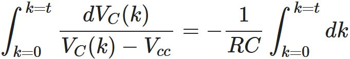
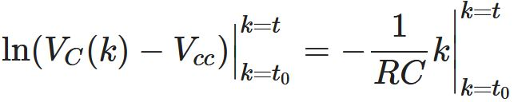
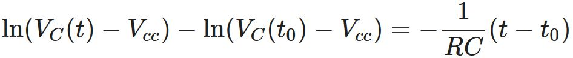
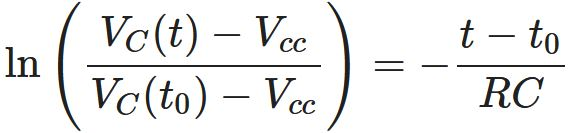
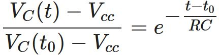
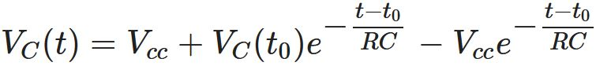
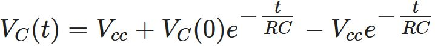

# RC Circuit
We will analyze resistor-capacitor (RC) circuits in this page.
## Step Response of RC Circuit
Mathematical model of the capacitor is given by

If we take the integral of both sides of the equation from k=t0 to k=t, then we obtain the solution

Here k is known as the dummy variable that serves as a temporary variable name as now t becomes a certain moment in time. Now, let's analyze the step response1 of RC circuit shown in Fig. 1.

*Figure 1:* RC circuit connected to a DC power supply.

When we apply Kirchoff's Voltage Law (KVL) on the RC circuit shown in *Fig. 1*, we get

-Vcc + Ri(t) + VC(t) = 0

The current that passes through the capacitor iC(t) is the same as the current i(t) that flows in the circuit (i.e., iC(t)=i(t)) as can be seen in *Fig. 1*. Considering this fact while substituting the capacitor's mathematical model in the equation obtained by KVL yields

the first order differential equation. If we manipulate the equation, it becomes

More manipulations result in

Now, let's take the integral of both sides from k=t0 to k=t.

Notice that the statement at the left is related to natural logarithm. Let's continue step by step

The expression with natural logarithm at the left becomes

and now if we write both sides as exponents of e ≈ 2.71 (nothing is going to change while we eliminate the ln from the left side)

eventually we obtain the equation

In general, we assume t0=0 that updates the equation above as

We will plot the graph of this final equation but before that, let's think roughly on how the voltage across the capacitor would behave by focusing on extreme values: At t=0 moment, VC(0)=VC(0) and while t→∞, VC(∞)=Vcc. Also as the time constant τ := RC increases, VC(t) reaches Vcc slower while lower values of τ result in VC(t) to converge to Vcc faster.

Now, let's illustrate the solution for various values of R ve C and see the effect of the time constant on the capacitor voltage.

*Figure 2:* Step response of the RC circuit for Vcc = 5V, VC(0) = 0V and various R and C values.2.

*Figure 3:* Step response of the RC circuit for Vcc = 5V, VC(0) = 0V and various R and C values.3.
## Footnotes
1 The response is called as the step response in [1] as we assume that at t=0, a DC power supply is connected to the circuit. If power supply becomes an AC source, then it is more reasonable to refer to the response as the forced response (as [2] does), which is a more general name.  
2 This graph is plotted in **MATLAB**. To obtain the same plot, run *RC_circuit_step_response.m* script in the [codes](https://github.com/gumushane-eem-eesec-440/RC-circuit/codes) subdirectory at this page. 
3 This graph is plotted with **Python** in **Google COLAB** environment. To obtain the same plot, run *RC_circuit.ipynb* file in the *codes* subdirectory at this page. 
## References
[1] J. W. Nilsson, S. A. Riedel, Electric Circuits, 10. Baskı, Prentice Hall, Upper Saddle River, New Jersey, 2014. 
[2] M. Ö. Efe, Devre Analizi-I, 3. Baskı, Seçkin Yayıncılık, Ankara, 2016.
