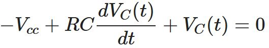
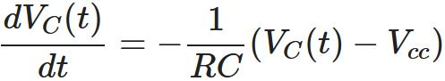
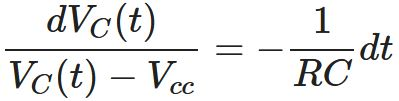

# RC Circuit
We will analyze resistor-capacitor (RC) circuits in this page.
## Step Response of RC Circuit
Mathematical model of the capacitor is given by

If we take the integral of both sides of the equation from k=t0 to k=t, then we obtain the solution

Here k is known as the dummy variable that serves as a temporary variable name as now t becomes a certain moment in time. Now, let's analyze the step response1 of RC circuit shown in Fig. 1.

*Figure 1:* RC circuit connected to a DC power supply.

When we apply Kirchoff's Voltage Law (KVL) on the RC circuit shown in *Fig. 1*, we get

-Vcc + Ri(t) + VC(t) = 0

The current that passes through the capacitor iC(t) is the same as the current i(t) that flows in the circuit (i.e., iC(t)=i(t)) as can be seen in *Fig. 1*. Considering this fact while substituting the capacitor's mathematical model in the equation obtained by KVL yields

the first order differential equation. If we manipulate the equation, it becomes

More manipulations result in

Eşitliğin her iki tarafının integralini k=t0'dan k=t anına kadar alalım.

Dikkat edilirse soldaki ifade doğal logaritma ile alakalı bir integral. İntegralleri alarak ilerleyecek olursak

soldaki doğal logaritma içeren ifadelerle yapılan çıkarma işlemi, aşağıdaki halini alırken

her iki tarafı e ≈ 2.71'in üssü olarak yazarsak (birşey değişmeyeği gibi sol taraftaki doğal logaritma ln ifadesinden kurtulmuş olacağız)

en sonunda aşağıdaki çözümü elde ederiz.

Genelde t0=0 olarak kabul ettiğimizden elde ettiğimiz çözüm aşağıdaki son halini alır.

Aşağıda grafiğini çizdireceğimiz kapasitörün üzerindeki voltajın matematiksel ifadesi olan bu ifade hakkında hemen kabaca (yani ekstrem değerlere bakarak) düşünecek olursak t=0 anında VC(0)=VC(0) ve t→∞ durumunda VC(∞)=Vcc olduğunu görebiliriz. Ayrıca zaman sabitimiz olan τ = RC arttıkça VC(t)'nin Vcc'ye ulaşması yavaşlarken τ azalırken VC(t)'nin Vcc'ye ulaşması hızlanır.

Şimdi elde ettiğimiz çözümün değişik R ve C değerlerine göre grafiklerini çizdirelim ve zaman sabitinin kapasitörün voltajına olan etkisini görelim.

*Figure 2:* Step response of the RC circuit when Vcc = 5V, VC(0) = 0V while R and C takes various values.2.

*Figure 3:* RC devresinin basamak cevabının Vcc = 5V, VC(0) = 0V ve değişik R ve C değerlerine göre grafiği3.

## Footnotes
1 İng. Step response. Basamak cevabı [1]'de geçen bir kavramdır. Aynı kaynağı referans kullanan [2], bu cevabı zorlanmış cevap diye isimlendirerek yaklaşımı daha genelleştirmiştir (i.e., güç kaynağından devreye etki eden sinyalin sadece sabit bir DC gerilim olma şartı yok). Biz burada [1]'de geçen haliyle kullanmayı uygun gördük.  
2 Bu grafik **MATLAB**'da çizdirilmiştir. Siz de **MATLAB**'da çizdirmek için *kodlar* dizinindeki *RC_devresi_zorlanmis_cevap.m* programını koşturun. 
3 Bu grafik  **MATLAB** ile çizdirilmiştir. Siz de **MATLAB** ile çizdirmek için *kodlar* dizinindeki *RC_devresi_dogal_cevap.m* programını koşturun. 
## References
[1] J. W. Nilsson, S. A. Riedel, Electric Circuits, 10. Baskı, Prentice Hall, Upper Saddle River, New Jersey, 2014. 
[2] M. Ö. Efe, Devre Analizi-I, 3. Baskı, Seçkin Yayıncılık, Ankara, 2016.
